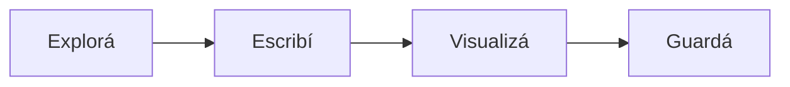
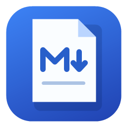

# Claro MD 3

**Leé, escribí y explorá tus ideas.** Todo queda en tu equipo, sin conexión y sin WebView2.

## Tu espacio de escritura

Elegí **Dividida** para editar Markdown y ver el resultado en vivo. **Edición** te deja toda la pantalla para escribir. **Lectura** muestra el documento terminado.

- Creá un documento con **Ctrl+N**.
- Abrí un archivo con **Ctrl+O** o una carpeta con **Ctrl+Shift+O**.
- Guardá con **Ctrl+S** y elegí otra ubicación con **Ctrl+Shift+S**.
- Buscá y reemplazá texto con **Ctrl+F**.

> Los cambios se guardan en el archivo sólo cuando lo decidís. Si cerrás con cambios pendientes, Claro MD te pregunta qué hacer. Los borradores permiten recuperar trabajo interrumpido.

## Carpetas a mano

Acceso rápido muestra las carpetas reales de Windows: Escritorio, Descargas, Documentos, Imágenes, Música y Vídeos. Debajo de la línea están tus discos. También podés escribir una ruta en el explorador.

## Ideas que se ven



Los gráficos se pueden ampliar, ver como código o exportar a SVG.

### Fórmulas

Una fórmula en línea: $E = mc^2$.

$$
\int_0^1 x^2\,dx = \frac{1}{3}
$$

### Código

```javascript
const ideas = ["Leer", "Editar", "Compartir"];
ideas.forEach(idea => console.log(idea));
```

### Tu lista

- [x] Chromium incluido
- [x] Markdown y gráficos sin conexión
- [ ] Escribir mi próximo documento

| Modo | Para qué sirve |
| --- | --- |
| Lectura | Leer con calma |
| Edición | Escribir sin distracciones |
| Dividida | Ver cada cambio en vivo |

## Identidad propia



Claro MD 3 · Electron · Tu biblioteca y tus documentos, en tu equipo.
